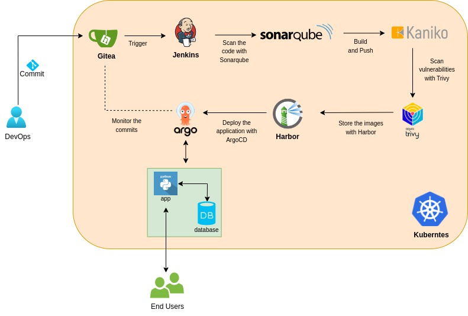
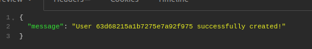
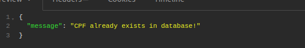
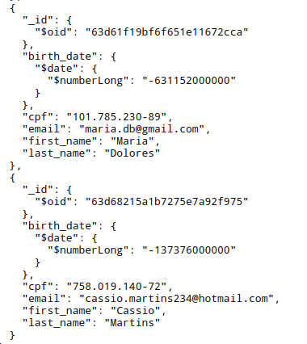

## 💡 Idea
Through a simple application in Python using Rest API, the application can do user creation, ID validation and validate the user within the database running in MongoDB hosted in Kubernetes based in Gitflow.

The trigger started with the code stored in the Gitea, and based on the webhook a job is started in Jenkins, monitoring different branches (Gitflow), and based on the source code stored in the Gitea is scanned with Sonarqube, where the next stage is build/push the docker image using Kaniko (Build images in Kubernetes). 

Before storing the image in Harbor, using the API of Trivy is possible to scan the image built previously to find the critical vulnerabilities, if the image is Correct without Criticals vulnerabilities the image is stored in Harbor and the deployment in Kubernetes is started with ArgoCD monitoring the new commit in the Gitea repository.

---

### 🛠️ Worked with
* Python
* REST
* Flake8
* Gitea
* Docker
* Kubernetes (Kind)
* Make
* MongoDB
* Sonarqube
* Kaniko
* Harbor
* ArgoCD
* Jenkins
---

'''
Insert user on MongoDB
'''

'''
Validation User basead on ID
'''

'''
Consult APP using the class /users
'''

