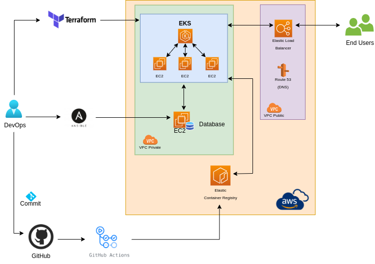
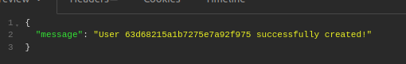
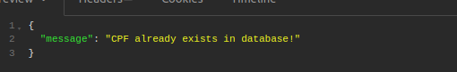
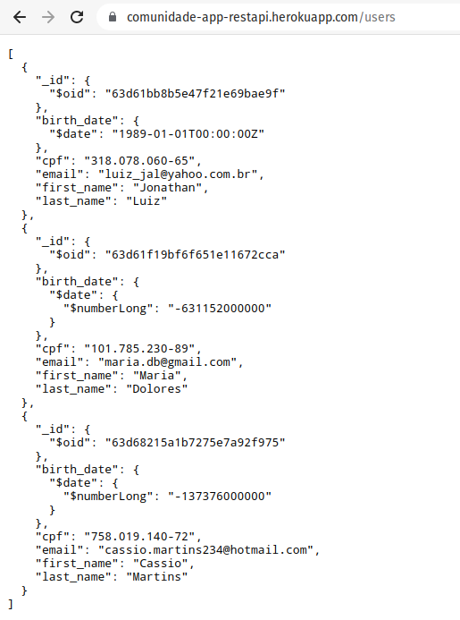

## 💡 Idea
Through a simple application in Python using Rest API, the application can do user creation, ID validation and validate the user within the database running in MongoDB hosted in AWS EC2, and the application running in AWS EKS (Amazon Kubernetes Service).

---

### 🛠️ Worked with
* Python
* REST
* Flake8
* Docker
* Docker Compose
* Make
* MongoDB
* Terraform
* AWS
* Kubernetes (EKS)
* GitHub Actions
---

### 🧾 Prerequisites
* Docker
* Docker Compose
* Python
* MongoDB API
* Terraform
* AWS
* Kubernetes
---

'''
Insert user on MongoDB
'''

'''
Validation User basead on ID
'''

'''
Consult APP using the class /users
'''

